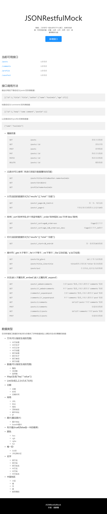

# JSONRestfulMock
based on json-server, mockjs, and umi, mock interfaces with real data in restful styles automatic

## setup
```
git clone git@github.com:huxinmin/jsonRestfulMock.git
cd jsonRestfulMock
npm i && npm run start
```
then visit `http://127.0.0.1:3000`, you will see the page like blow, and all usages is already in it;

